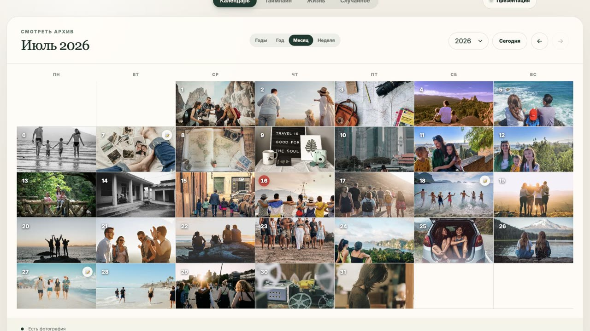

# Фото дня

Локальное приложение для просмотра личного фотоархива в виде календаря, таймлайна и карты дней. Его можно запускать в браузере или как отдельное Electron-приложение для macOS и Windows. Репозиторий содержит только код: фотографии, дневниковые записи, локальные настройки и сгенерированные превью исключены через `.gitignore`.

[Открыть сайт](https://polyakovin.github.io/daily-photos/) · [Скачать последнюю версию](https://github.com/polyakovin/daily-photos/releases/latest)



_Демонстрационные фотографии: [Unsplash](https://unsplash.com/)._

## Запуск

### Десктоп-приложение

Требуется Node.js. Установите зависимости и запустите Electron:

```sh
npm install
npm run desktop
```

При первом запуске приложение предлагает выбрать любую папку с изображениями или запустить автопоиск. Автопоиск сканирует Pictures текущего пользователя и только фотопапки (`DCIM`, `Pictures`, `Photos`, `Images`) подключённых носителей; системные каталоги, Music, Movies и приложения пропускаются. На macOS это также исключает серию запросов доступа к отдельно защищённым Desktop, Documents и Downloads — при необходимости такую папку можно выбрать явно. Во время поиска видны прогресс, количество обработанных файлов и примерное время окончания. Позже источник можно сменить кнопкой в верхней панели или через пункт меню «Файл → Источник фотографий…». Выбранный режим и локальный индекс хранятся только в системном профиле приложения.

Если для одной даты найдено несколько снимков, просмотрщик показывает ленту вариантов. Нажатый вариант становится фотографией дня для календаря, таймлайна, карты жизни и случайного режима; выбор сохраняется локально между запусками.

Установленная версия раз в неделю проверяет GitHub Releases. Если найдено обновление, приложение предлагает скачать его, а после загрузки — перезапуститься для установки. В любой момент проверку можно запустить вручную через «Фото дня → Проверить обновления…» на macOS или «Справка → Проверить обновления…» на Windows.

Готовые дистрибутивы собираются командами:

```sh
npm run dist:all
npm run dist:mac
npm run dist:win
```

Перед каждой сборкой каталог `release` очищается автоматически. `dist:all` собирает оба варианта за один запуск; сборка macOS создаёт универсальные DMG и ZIP для Apple Silicon и Intel, а сборка Windows — x64 NSIS-установщик.

Для работы автоматического обновления в GitHub Release вместе с установщиками необходимо загрузить созданные Electron Builder файлы `latest-mac.yml`, `latest.yml` и соответствующие `.blockmap`. Версия релиза и тег в формате `vX.Y.Z` должны совпадать с полем `version` в `package.json`.

Сборку macOS нужно подписывать действующим сертификатом Developer ID Application и выпускать с той же подписью от версии к версии. Неподписанное приложение может собрать установщик, но автоматическая установка обновлений на macOS не гарантируется.

### Веб-версия

Для запуска локального сервера зависимости устанавливать не нужно.

```sh
npm start
```

После запуска откройте <http://127.0.0.1:4173>. На macOS можно также запустить файл `Запустить Фото дня.command`.

### Быстрый запуск на macOS

Откройте `Запустить Фото дня.command` двойным щелчком в Finder. Лаунчер сам определит папку проекта, найдёт Node.js, запустит или перезапустит локальный сервер и откроет приложение в браузере по адресу <http://127.0.0.1:4173>.

Если macOS не разрешает открыть файл при первом запуске, выберите его в Finder правой кнопкой мыши и нажмите «Открыть». Диагностика запуска записывается в `.local/photo-day-server.log`; весь каталог `.local` исключён из Git.

## Структура проекта

- `src/renderer/` — HTML, CSS и клиентская логика календаря;
- `src/server/` — локальный HTTP-сервер и индексация фотоархива;
- `src/electron/` — десктопная оболочка, preload и обновления;
- `scripts/` — подготовка WebP и превью;
- `test/` — автотесты;
- `docs/` — публичные изображения и стили;
- `build/` — исходные иконки сборки;
- `content/` — локальный фотоархив, не попадающий в Git;
- `.local/` — кэш, превью, логи и локальное состояние.

`node_modules/` и `release/` — воспроизводимые каталоги зависимостей и сборок; оба игнорируются Git.

## Структура архива

В десктоп-приложении выберите любую папку с изображениями или запустите автопоиск по стандартным фотокаталогам. Дата сначала читается из метаданных EXIF/XMP (`DateTimeOriginal`, `CreateDate` и близкие поля), затем — из пути, а при их отсутствии — из даты создания файла. Для веб-версии создайте каталог `content` в корне проекта: в ней дата должна встречаться в пути в одном из поддерживаемых видов:

- `2026/07/15 фото.webp`;
- `2026.07.15 фото.jpg`;
- `2026-07-15 фото.png`.

Поддерживаются WebP, JPEG, PNG, GIF и AVIF. Записи дневника храните в подпапке `_diary` с именами вида `2026.07.15.md`. Десктоп-приложение читает файлы без изменения оригиналов. Для подготовки HEIC и генерации WebP/превью используйте `scripts/images-to-webp.sh` и `scripts/generate-photo-previews.sh`.

Каталог `content` и локальное состояние в `.local` не попадают в Git. Перед публикацией изменений рекомендуется проверить результат командой `git status --ignored` и убедиться, что локальные данные отмечены как игнорируемые.

## Лицензия

Проект распространяется по лицензии [MIT](LICENSE).
