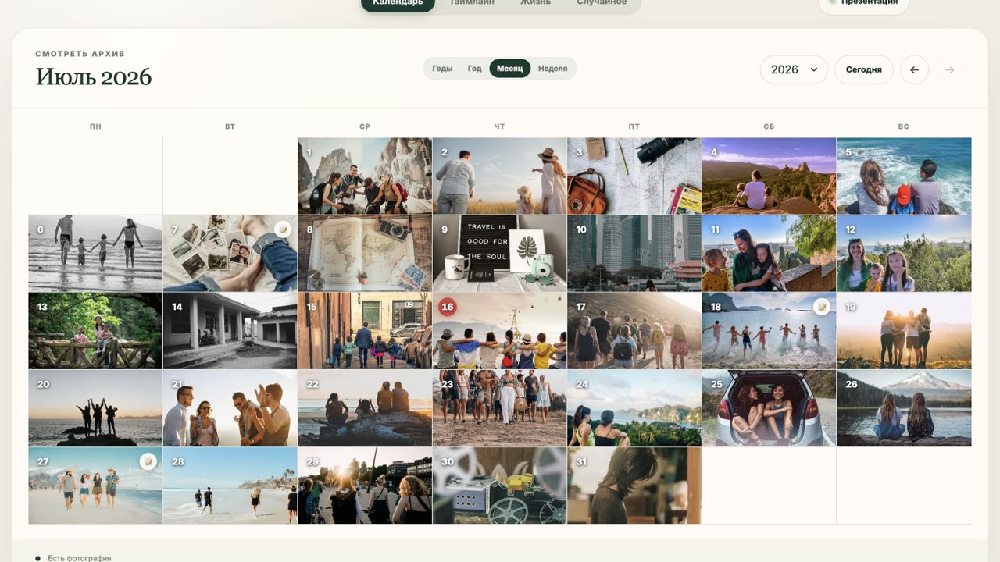

# Фото дня

Локальное приложение для просмотра личного фотоархива в виде календаря, таймлайна, карты посещённых мест и карты дней. Его можно запускать в браузере или как отдельное Electron-приложение для macOS и Windows. Репозиторий содержит только код: фотографии, дневниковые записи, локальные настройки и сгенерированные превью исключены через `.gitignore`.

[Открыть сайт](https://polyakovin.github.io/daily-photos/) · [Скачать последнюю версию](https://github.com/polyakovin/daily-photos/releases/latest)



_Демонстрационные фотографии: [Unsplash](https://unsplash.com/)._

## Запуск

### Десктоп-приложение

Для сборки и тестов зафиксированы Node.js `24.15.0` и npm `11.12.1`. С nvm окружение
подготавливается так:

```sh
nvm use
npm ci
npm run preflight
npm run desktop
```

`preflight` останавливается на другой версии Node/npm, сверяет закреплённые версии Electron и
Electron Builder, проверяет системные `cwebp`, `gif2webp`, `webpinfo`, `ffmpeg`, `exiftool` и
`heif-convert`, а затем выполняет настоящую конвертацию маленьких PNG, AVIF и HEIC во временной
папке. Фотоархив пользователя при этом не затрагивается.

При первом запуске приложение предлагает выбрать любую папку с изображениями или запустить автопоиск. Автопоиск сканирует Pictures текущего пользователя и только фотопапки (`DCIM`, `Pictures`, `Photos`, `Images`) подключённых носителей; системные каталоги, Music, Movies и приложения пропускаются. На macOS это также исключает серию запросов доступа к отдельно защищённым Desktop, Documents и Downloads — при необходимости такую папку можно выбрать явно. Во время поиска видны прогресс, количество обработанных файлов и примерное время окончания. Позже источник можно сменить кнопкой в верхней панели или через пункт меню «Файл → Источник фотографий…». Выбранный режим и локальный индекс хранятся только в системном профиле приложения.

Если для одной даты найдено несколько снимков, просмотрщик показывает ленту вариантов. Нажатый вариант становится фотографией дня для календаря, таймлайна, карты жизни и случайного режима; выбор сохраняется локально между запусками.

Светлую и тёмную темы можно переключать в верхней панели. В обеих темах числа календаря поверх фотографий отображаются белыми для сохранения контраста.

Информационная кнопка в верхней панели открывает окно «О приложении». В нём указаны автор и ссылки на его ресурсы, версия и дата текущей сборки, среда выполнения, а также актуальная локальная диагностика архива: количество снимков и дней, записи, геометки, сохранённые места, период данных, источник и состояние индекса. Полные пути к пользовательским папкам в диагностике не показываются, а сведения никуда не отправляются.

В просмотрщике рядом с датой можно выбрать другой день съёмки: кнопка «Изменить дату» сразу открывает календарь, а выбор дня сразу запускает перенос. Поле даты остаётся доступным для ручного ввода с подтверждением кнопкой «Перенести». При работе с выбранной папкой приложение переносит исходный файл в путь, соответствующий структуре архива, не перезаписывает уже существующие снимки и сохраняет за фотографией ручную геометку. В режиме автоматического поиска по компьютеру смена даты недоступна.

Во всех формах дата вводится одинаково: её можно быстро напечатать в привычном формате `ДД.ММ.ГГГГ` (также принимаются однозначные день и месяц, `/`, `-` или восемь цифр подряд) либо выбрать кнопкой календаря. В раскрытом календаре кнопки в шапке листают месяцы, а при фокусе в сетке клавиши `←`/`→` меняют месяц и `↑`/`↓` — год. День выбирается нажатием или клавишами `Enter`/`Space`; стрелки между днями не перемещаются. При смене даты фотографии занятые снимками дни отмечаются точкой, а при наведении показывается превью фотографии, поэтому свободные даты видны сразу. Календарь начинает неделю с понедельника и не предлагает недоступные даты.

В десктопном просмотрщике фотографию можно переместить в системную Корзину. Приложение всегда запрашивает подтверждение, после операции обновляет индекс архива, а файл остаётся доступен для восстановления средствами системы.

В десктоп-приложение можно перетащить одну или несколько фотографий из проводника. Перед сохранением приложение предлагает дату съёмки из EXIF. Если её нет и открыт календарь года, месяца или недели, выбирается последняя свободная дата из видимого периода; в остальных случаях — сегодняшняя дата. Значение можно изменить. При первом добавлении приложение анализирует наиболее распространённую структуру путей и имён архива, сохраняет найденный шаблон в `photo_import_config.json` в корне выбранной папки и повторно использует его. Например, архив с файлами вида `ГГГГ/ММ/ДД.jpg` продолжает получать файлы с именем дня без добавления исходного имени фотографии. Если устойчивого шаблона нет, применяется нейтральное имя с датой. В том же конфигурационном файле хранятся выбранные даты импортированных снимков, поэтому исходный EXIF не переопределяет выбор пользователя. GPS-координаты из EXIF также индексируются после импорта и сохраняются при включённой конвертации в WebP. После копирования фотографии автоматически появляются в календаре и на карте. В режиме автоматического поиска сначала нужно выбрать одну папку архива.

В просмотрщике снимок также можно отметить как фото месяца или года. При работе с выбранной папкой эти отметки хранятся как даты `YYYY-MM-DD` в файле `period_photo_selections.json` в корне самой папки, поэтому переносятся вместе с архивом. Старые записи с ID автоматически переводятся в даты при индексации. В режиме автоматического поиска по компьютеру файл хранится в системном профиле приложения.

Список снимков, скрываемых блюром в режиме презентации, аналогично хранится в `presentation_blur_dates.json`: в корне выбранной папки или в системном профиле при автоматическом поиске.

В режиме «Карта» приложение читает GPS из EXIF и позволяет поставить или исправить точку прямо на общей карте либо в просмотрщике фотографии. Если у открытого снимка есть геометка, в левом верхнем углу просмотрщика появляется полупрозрачная мини-карта с точкой съёмки; при наведении она становится непрозрачной, а нажатие открывает общую карту в этом месте. С карты можно добавить самостоятельное место, а из его карточки — выбрать и привязать фотографию. Сохранённые места также отображаются в редакторе геометки снимка и находятся по названию без обращения к внешнему поиску. Ручные и импортированные координаты фотографий, самостоятельные места из Obsidian и Organic Maps хранятся вместе в `photo_locations.json` в корне выбранной папки. Старый `location_reference.json` автоматически переносится в единый файл и удаляется после успешной записи. Места с одинаковыми координатами карты (с точностью до пяти знаков после запятой) объединяются: основной остаётся наиболее информативная запись, а исходные записи сохраняются в её истории; связи фотографий переводятся на основной идентификатор. Самостоятельная метка не рисуется поверх фотографии с теми же координатами: после выбора существующего места её заменяет маркер фотографии, а данные и связь с местом остаются доступны в карточке и поиске. Фотографии записываются по относительным путям, поэтому метки переносятся вместе с архивом; ручная точка имеет приоритет над EXIF, а EXIF — над координатами, автоматически сопоставленными из внешних источников. Явно скрытая фотография не возвращается на карту из EXIF, но остаётся в очереди «Расставить без места» наравне со всеми снимками без координат; обычное удаление ручной привязки разрешает возврат координат из EXIF. В режиме автоматического поиска по компьютеру файл остаётся в системном профиле приложения.

В карточках карты фотография открывается нажатием на превью; отдельная кнопка открытия не дублируется. Точка открытой карточки, в том числе после действия «Открыть на карте» из просмотрщика, выделяется контрастным золотым ореолом. При наведении на точку с несколькими снимками веер показывает не более 30 случайно выбранных миниатюр, а счётчик на маркере сохраняет полное число фотографий. Точки, которые остаются одним маркером даже при максимальном увеличении, считаются одним местом в сводке и при расчёте популярности. Перетаскивание, начатое прямо на маркере, двигает карту так же, как жест на свободном месте; короткое нажатие по-прежнему открывает точку. Кнопка «Анимация» воспроизводит перемещения день за днём: карта постепенно дорисовывает пройденный маршрут и показывает миниатюру выбранной фотографии каждого дня. В нижней панели можно поставить воспроизведение на паузу, выбрать любой день ползунком или стрелками и изменить скорость от 0,5× до 4×. В тёмной теме активные действия панели карты выделяются контрастной заливкой и рамкой, а отключённые кнопки остаются отчётливо приглушёнными. Кнопка «Выбрать место» переводит карту в режим постановки точки для этой фотографии; то же действие доступно клавишей `M`, пока карточка снимка открыта и фокус не находится в поле ввода. Ранее сохранённое место можно выбрать отдельным действием «Из сохранённых». В режиме разметки строка поиска располагается сверху справа от карточки текущего снимка; на узком экране она переносится вниз, чтобы не перекрывать превью. Подсказки не занимают место постоянно и открываются отдельной кнопкой: «Недавние» повторяют последние сохранённые места, которые пользователь назначал фотографиям, а «Популярные» ранжируются по количеству снимков во всех фототочках, включая кластеры без отдельной сохранённой метки. Те же списки доступны по кнопке «Места» в редакторе геометки внутри просмотрщика.

В macOS-настройках выбранной папки можно включить опцию «Конвертировать и заменять оригиналы». Тогда JPG, PNG, GIF, AVIF, HEIC и HEIF внутри этой папки рекурсивно конвертируются в WebP, проверяются и только после успешной проверки заменяют исходные файлы. Каждый файл обрабатывается независимо: ошибка одного снимка сохраняет только его оригинал и не мешает заменить остальные. Опция по умолчанию выключена, требует отдельного подтверждения и недоступна для автоматического поиска по нескольким папкам. Для конвертации в системе должны быть установлены `webp`, `ffmpeg`, `exiftool` и, для HEIC/HEIF, `libheif`.

Миниатюры для календаря и таймлайна создаются по мере просмотра и сохраняются в локальном кэше профиля приложения. При изменении оригинала превью обновляется автоматически; полноразмерный файл загружается только в просмотрщике.

Установленная версия раз в неделю проверяет GitHub Releases. Если найдено обновление, приложение предлагает скачать его, а после загрузки — перезапуститься для установки. В любой момент проверку можно запустить вручную через «Фото дня → Проверить обновления…» на macOS или «Справка → Проверить обновления…» на Windows.

Перед сборкой выполняются preflight, синтаксическая проверка и последовательный прогон тестов.
Локальные и публикуемые macOS-сборки разделены:

```sh
npm run verify
npm run dist:all
npm run dist:mac:local
npm run dist:mac:release
npm run dist:win
```

`dist:mac` сохранён как алиас локальной команды. Локальная macOS-сборка явно не требует подписи и
не предназначена для публикации. `dist:mac:release` требует Developer ID Application и параметры
notarization; без них команда завершается до сборки.

После macOS-сборки автоматическая проверка:

- распаковывает ZIP и проверяет состав `app.asar` и unpacked-скриптов;
- подтверждает обе архитектуры — Apple Silicon и Intel;
- монтирует DMG read-only и копирует приложение во временный `Applications`-каталог;
- запускает именно packaged-приложение с изолированным профилем;
- через Chrome DevTools Protocol проверяет preload/IPC, загрузку темы и карты и переключение темы;
- в release-режиме требует валидные `codesign`, Gatekeeper assessment и stapled notarization ticket.

GUI smoke можно пропустить только явно: `PHOTO_DAY_SKIP_GUI_SMOKE=1 npm run verify:mac`. Такой
результат не считается полной проверкой целевой среды.

Перед каждой сборкой каталог `release` очищается автоматически. `dist:all` собирает оба варианта за один запуск; сборка macOS создаёт универсальные DMG и ZIP для Apple Silicon и Intel, а сборка Windows — x64 NSIS-установщик.

Для работы автоматического обновления в GitHub Release вместе с установщиками необходимо загрузить созданные Electron Builder файлы `latest-mac.yml`, `latest.yml` и соответствующие `.blockmap`. Версия релиза и тег в формате `vX.Y.Z` должны совпадать с полем `version` в `package.json`.

Сборку macOS нужно подписывать действующим сертификатом Developer ID Application и выпускать с той
же подписью от версии к версии. Для локального Keychain подходит установленная identity; для CI —
`CSC_LINK` и `CSC_KEY_PASSWORD`. Notarization настраивается одной из поддерживаемых групп:

- `APPLE_API_KEY`, `APPLE_API_KEY_ID`, `APPLE_API_ISSUER`;
- `APPLE_ID`, `APPLE_APP_SPECIFIC_PASSWORD`, `APPLE_TEAM_ID`;
- `APPLE_KEYCHAIN_PROFILE` и, при необходимости, `APPLE_KEYCHAIN`.

`preflight:release` проверяет наличие этих настроек без вывода секретов. Неподписанная локальная
сборка остаётся доступной, но команда публикации её не пропустит.

### Веб-версия

Для запуска локального сервера зависимости устанавливать не нужно.

```sh
npm start
```

После запуска откройте <http://127.0.0.1:4173>. На macOS можно также запустить файл `Запустить Фото дня.command`.

### Быстрый запуск на macOS

Откройте `Запустить Фото дня.command` двойным щелчком в Finder. Лаунчер сам определит папку проекта, найдёт Node.js, запустит или перезапустит локальный сервер и откроет приложение в браузере по адресу <http://127.0.0.1:4173>.

Если macOS не разрешает открыть файл при первом запуске, выберите его в Finder правой кнопкой мыши и нажмите «Открыть». Диагностика запуска записывается в `.local/photo-day-server.log`; весь каталог `.local` исключён из Git.

## Структура проекта

- `src/renderer/` — HTML, CSS и клиентская логика календаря;
- `src/server/` — локальный HTTP-сервер и индексация фотоархива;
- `src/electron/` — десктопная оболочка, preload и обновления;
- `scripts/` — подготовка WebP, превью и импорт геоданных;
- `test/` — автотесты;
- `docs/` — публичные изображения и стили;
- `build/` — исходные иконки сборки;
- `content/` — локальный фотоархив, не попадающий в Git;
- `.local/` — кэш, превью, логи и локальное состояние.

`node_modules/` и `release/` — воспроизводимые каталоги зависимостей и сборок; оба игнорируются Git.

## Структура архива

В десктоп-приложении выберите любую папку с изображениями или запустите автопоиск по стандартным фотокаталогам. Дата сначала читается из метаданных EXIF/XMP (`DateTimeOriginal`, `CreateDate` и близкие поля), затем — из пути, а при их отсутствии — из даты создания файла. Для веб-версии создайте каталог `content` в корне проекта: в ней дата должна встречаться в пути в одном из поддерживаемых видов:

- `2026/07/15.webp`;
- `2026/07/15 фото.webp`;
- `2026.07.15 фото.jpg`;
- `2026-07-15 фото.png`.

Поддерживаются WebP, JPEG, PNG, GIF и AVIF. Записи дневника храните в подпапке `_diary` с именами вида `2026.07.15.md`. Десктоп-приложение читает файлы без изменения оригиналов. Для подготовки HEIC и генерации WebP/превью используйте `scripts/images-to-webp.sh` и `scripts/generate-photo-previews.sh`.

Каталог `content` и локальное состояние в `.local` не попадают в Git. Перед публикацией изменений рекомендуется проверить результат командой `git status --ignored` и убедиться, что локальные данные отмечены как игнорируемые.

## Лицензия

Проект распространяется по лицензии [MIT](LICENSE).
